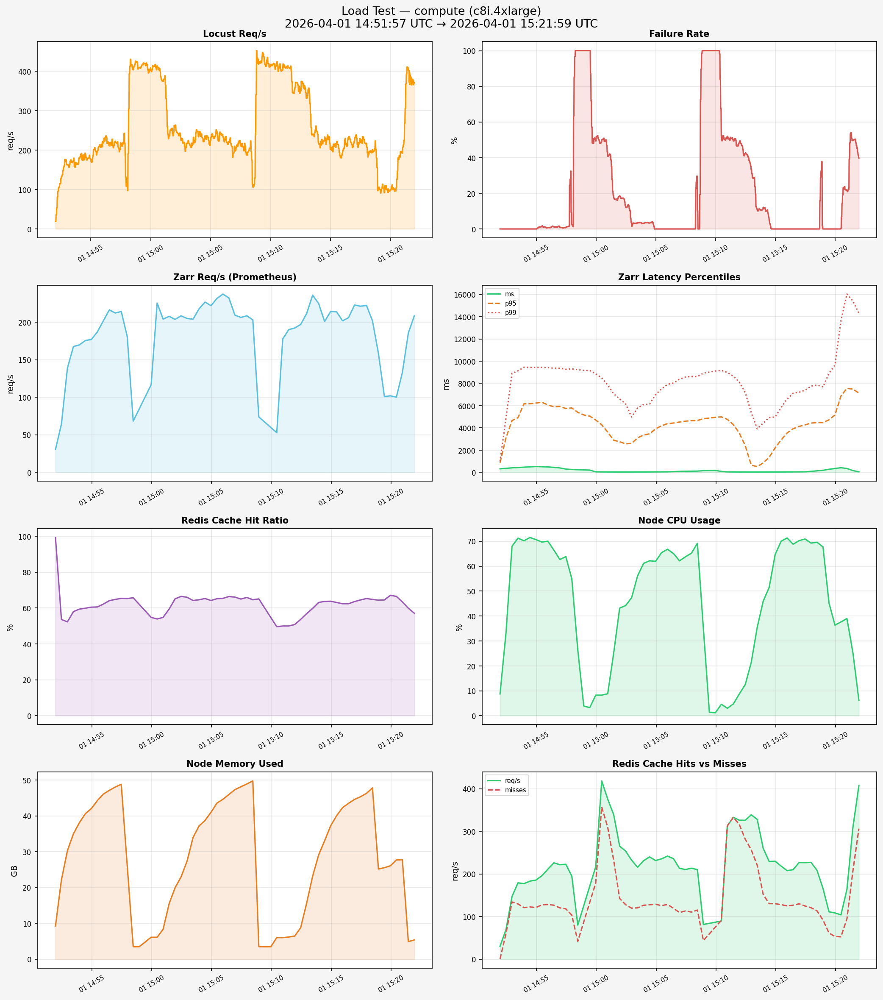

# Load Test Report — compute (c8i.4xlarge)

**Generated:** 2026-04-01 15:22:00
**Test window:** 2026-04-01 14:51:57 UTC → 2026-04-01 15:21:59 UTC

## Time Series Charts

## Performance Over Time (sampled every ~5 min)

| Time | Zarr req/s | p50 (ms) | p95 (ms) | p99 (ms) | Cache Hit % | CPU % | Mem (GB) | Mem % |
|------|-----------|----------|----------|----------|-------------|-------|----------|-------|
| 14:51 | 30.5 | 321.0 | 859.1 | 981.2 | 99.3% | 8.8 | 9.3 | 15.0% |
| 14:52 | 139.0 | 405.9 | 4655.8 | 8911.0 | 52.3% | 68.0 | 30.3 | 49.2% |
| 14:53 | 169.8 | 465.4 | 6163.5 | 9455.3 | 59.4% | 70.2 | 38.1 | 61.8% |
| 14:54 | 177.1 | 524.4 | 6231.8 | 9448.6 | 60.5% | 70.7 | 42.0 | 68.2% |
| 14:55 | 201.9 | 484.2 | 6056.5 | 9412.3 | 62.2% | 70.0 | 46.1 | 74.8% |
| 14:56 | 212.4 | 398.3 | 5933.5 | 9361.1 | 64.8% | 62.7 | 48.1 | 78.0% |
| 14:57 | 180.9 | 257.8 | 5791.0 | 9302.7 | 65.3% | 54.9 | 26.1 | 42.3% |
| 14:59 | 116.8 | 220.5 | 5162.4 | 9179.1 | 54.8% | 3.9 | 3.5 | 5.6% |
| 15:00 | 204.2 | 47.9 | 4705.0 | 8863.8 | 54.8% | 8.3 | 6.1 | 9.9% |
| 15:01 | 203.8 | 33.0 | 3618.4 | 7861.4 | 65.1% | 8.8 | 8.4 | 13.6% |
| 15:02 | 205.1 | 30.2 | 2752.4 | 6604.7 | 66.0% | 43.2 | 19.9 | 32.4% |
| 15:03 | 217.8 | 30.1 | 2605.2 | 4977.4 | 64.6% | 47.4 | 27.4 | 44.4% |
| 15:04 | 222.1 | 32.6 | 3357.2 | 6092.6 | 64.2% | 61.1 | 37.2 | 60.3% |
| 15:05 | 237.6 | 37.2 | 3910.3 | 6989.3 | 65.4% | 61.9 | 41.0 | 66.5% |
| 15:06 | 209.5 | 48.4 | 4380.3 | 7908.7 | 66.1% | 66.8 | 44.6 | 72.4% |
| 15:07 | 208.6 | 86.5 | 4524.7 | 8385.5 | 65.9% | 62.1 | 47.3 | 76.8% |
| 15:08 | 73.9 | 103.9 | 4649.7 | 8627.0 | 65.1% | 65.2 | 48.9 | 79.4% |
| 15:10 | 177.9 | 149.6 | 4818.2 | 8916.5 | 50.0% | 34.9 | 3.5 | 5.7% |
| 15:11 | 192.3 | 169.5 | 4949.8 | 9113.6 | 50.8% | 1.2 | 3.5 | 5.6% |
| 15:12 | 211.7 | 41.4 | 4765.1 | 8984.3 | 56.9% | 3.0 | 6.0 | 9.7% |
| 15:13 | 225.0 | 31.1 | 3536.7 | 8114.4 | 63.1% | 8.7 | 6.5 | 10.5% |
| 15:14 | 214.3 | 27.2 | 648.2 | 5380.6 | 63.8% | 21.4 | 15.7 | 25.4% |
| 15:15 | 201.9 | 27.9 | 843.2 | 4430.3 | 62.4% | 46.0 | 29.1 | 47.2% |
| 15:16 | 223.0 | 29.9 | 2198.3 | 4971.1 | 63.6% | 64.7 | 37.2 | 60.3% |
| 15:17 | 222.4 | 34.5 | 3543.5 | 6591.5 | 65.3% | 71.3 | 42.3 | 68.6% |
| 15:18 | 158.4 | 42.4 | 4130.4 | 7206.8 | 64.4% | 70.2 | 44.6 | 72.4% |
| 15:19 | 102.0 | 90.4 | 4431.0 | 7758.1 | 67.1% | 69.3 | 46.3 | 75.1% |
| 15:20 | 133.0 | 186.0 | 4473.8 | 7683.7 | 63.4% | 67.7 | 25.2 | 40.8% |
| 15:21 | 208.7 | 347.1 | 5161.0 | 9666.2 | 57.1% | 36.3 | 26.1 | 42.3% |

## Locust Results

| Metric | Value |
|--------|-------|
| Total Requests | 461,675 |
| Failures | 147,480 (31.94%) |
| Requests/s | 256.5 |
| p50 Latency | 25 ms |
| p95 Latency | 4200 ms |
| p99 Latency | 7500 ms |
| Max Latency | 61334 ms |
| Avg Latency | 733 ms |

## Prometheus Metrics (avg over test window)

| Metric | Value |
|--------|-------|
| Zarr Req/s | 182.99 |
| p50 Zarr Latency | 164 ms |
| p95 Zarr Latency | 4318 ms |
| p99 Zarr Latency | 8146 ms |
| 429 Rate Limits/s | N/A |
| 500 Errors/s | 0.00 |
| Avg Cache Hit Rate | 60.5% |
| Avg Cache Hits/s | 221.99 |
| Avg Cache Misses/s | 144.74 |
| Pod Restarts | 2 |
| Avg Node CPU | 4485.9% |
| Avg Node Memory Used | 28.0 GB / 61.6 GB (45.5%) |
| Avg Network RX | 95.6 MB/s |
| Avg Network TX | 119.4 MB/s |
