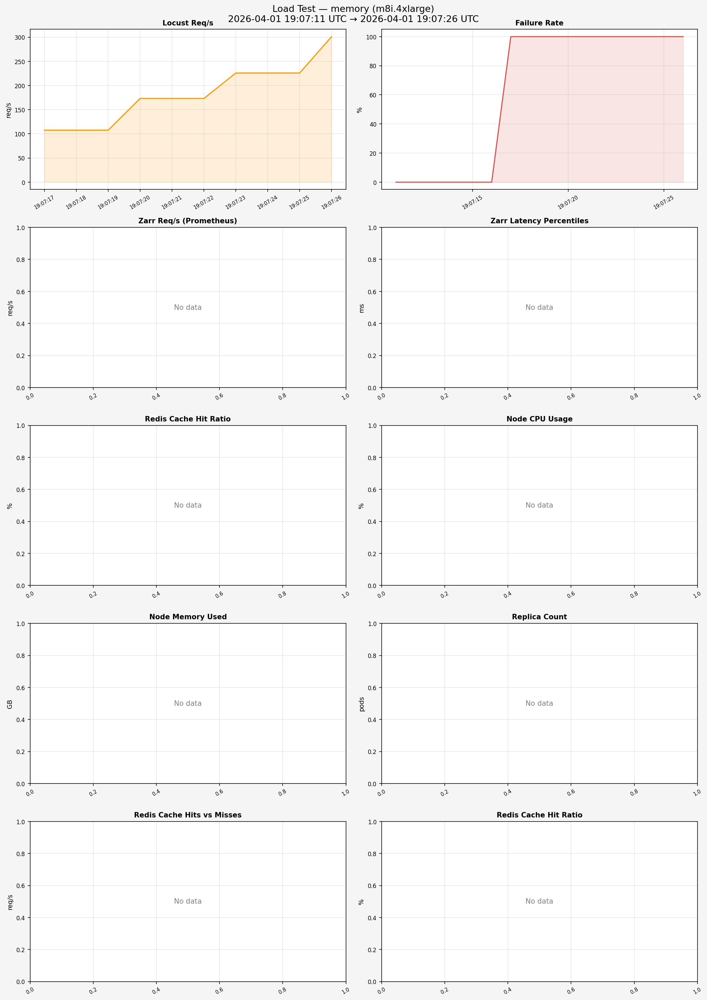

# Load Test Report — memory (m8i.4xlarge)

**Generated:** 2026-04-01 19:07:29
**Test window:** 2026-04-01 19:07:11 UTC → 2026-04-01 19:07:26 UTC

## Time Series Charts

## Performance Over Time (sampled every ~5 min)

_No time series data available._

## Locust Results

| Metric | Value |
|--------|-------|
| Total Requests | 4,284 |
| Failures | 4,284 (100.00%) |
| Requests/s | 296.0 |
| p50 Latency | 2 ms |
| p95 Latency | 14 ms |
| p99 Latency | 20 ms |
| Max Latency | 95 ms |
| Avg Latency | 4 ms |

## Prometheus Metrics (avg over test window)

| Metric | Value |
|--------|-------|
| Zarr Req/s | N/A |
| p50 Zarr Latency | N/A |
| p95 Zarr Latency | N/A |
| p99 Zarr Latency | N/A |
| 429 Rate Limits/s | N/A |
| 500 Errors/s | N/A |
| Avg Cache Hit Rate | N/A |
| Avg Cache Hits/s | N/A |
| Avg Cache Misses/s | N/A |
| Pod Restarts | 0 |
| Peak Replicas | 2 |
| Avg Node CPU | N/A |
| Avg Node Memory Used | N/A / N/A (N/A) |
| Avg Network RX | N/A/s |
| Avg Network TX | N/A/s |
