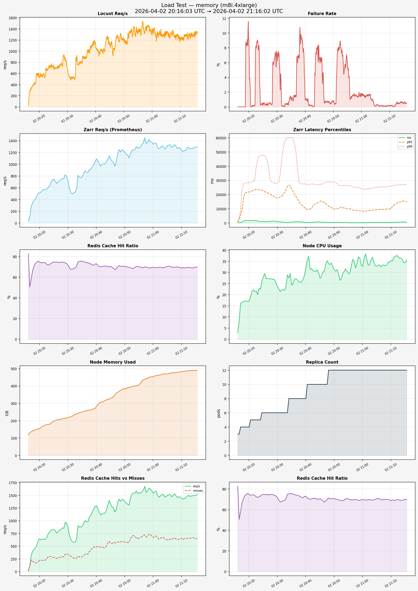

# Load Test Report — memory (m8i.4xlarge)

**Generated:** 2026-04-02 21:16:06
**Test window:** 2026-04-02 20:16:03 UTC → 2026-04-02 21:16:02 UTC

## Time Series Charts

## Performance Over Time (sampled every ~5 min)

| Time | Zarr req/s | p50 (ms) | p95 (ms) | p99 (ms) | Cache Hit % | CPU % | Mem (GB) | Mem % |
|------|-----------|----------|----------|----------|-------------|-------|----------|-------|
| 20:16 | 28.3 | 279.3 | 897.8 | 995.2 | 82.5% | 2.9 | 119.2 | 11.0% |
| 20:19 | 456.5 | 1744.9 | 21544.5 | 28339.1 | 74.6% | 17.2 | 149.7 | 13.9% |
| 20:22 | 563.9 | 1863.7 | 23540.4 | 30423.3 | 73.7% | 21.4 | 175.1 | 16.2% |
| 20:25 | 743.8 | 1039.2 | 22770.4 | 47904.8 | 74.8% | 27.8 | 197.5 | 18.3% |
| 20:28 | 761.2 | 1366.4 | 19583.2 | 28908.2 | 74.8% | 27.1 | 211.4 | 19.6% |
| 20:31 | 509.6 | 854.4 | 18357.5 | 34844.7 | 67.5% | 21.5 | 223.2 | 20.7% |
| 20:34 | 776.3 | 463.8 | 26571.7 | 60000.0 | 75.2% | 27.5 | 246.8 | 22.9% |
| 20:37 | 858.7 | 932.5 | 17144.8 | 39846.8 | 74.0% | 26.7 | 261.1 | 24.2% |
| 20:40 | 1090.7 | 466.1 | 9897.0 | 27354.1 | 73.0% | 32.0 | 283.5 | 26.3% |
| 20:43 | 1006.9 | 644.6 | 13222.7 | 27256.4 | 70.8% | 30.6 | 316.3 | 29.3% |
| 20:46 | 1030.6 | 594.0 | 14897.7 | 27502.0 | 68.5% | 30.2 | 338.6 | 31.4% |
| 20:49 | 1243.2 | 396.6 | 11025.3 | 28877.8 | 70.5% | 34.2 | 382.0 | 35.4% |
| 20:52 | 1182.5 | 483.4 | 10839.0 | 26332.7 | 69.1% | 26.5 | 394.9 | 36.6% |
| 20:55 | 1283.2 | 301.4 | 9929.5 | 26183.0 | 70.2% | 29.4 | 409.0 | 37.9% |
| 20:58 | 1369.1 | 252.7 | 8970.4 | 25001.5 | 69.5% | 33.8 | 444.8 | 41.2% |
| 21:01 | 1360.3 | 295.9 | 8265.7 | 23467.1 | 69.3% | 38.3 | 460.3 | 42.7% |
| 21:04 | 1258.5 | 373.3 | 9155.6 | 24874.2 | 69.5% | 34.1 | 470.2 | 43.6% |
| 21:07 | 1298.6 | 416.2 | 9614.3 | 25484.2 | 69.5% | 33.3 | 477.1 | 44.2% |
| 21:10 | 1233.5 | 450.8 | 10027.7 | 26016.9 | 68.7% | 35.4 | 483.1 | 44.8% |
| 21:13 | 1261.8 | 649.9 | 14718.6 | 26980.0 | 69.3% | 36.4 | 490.3 | 45.4% |

## Locust Results

| Metric | Value |
|--------|-------|
| Total Requests | 3,748,586 |
| Failures | 89,166 (2.38%) |
| Requests/s | 1041.2 |
| p50 Latency | 740 ms |
| p95 Latency | 12000 ms |
| p99 Latency | 23000 ms |
| Max Latency | 300024 ms |
| Avg Latency | 2572 ms |

## Prometheus Metrics (avg over test window)

| Metric | Value |
|--------|-------|
| Zarr Req/s | 999.24 |
| p50 Zarr Latency | 697 ms |
| p95 Zarr Latency | 14233 ms |
| p99 Zarr Latency | 30600 ms |
| 429 Rate Limits/s | N/A |
| 500 Errors/s | 0.01 |
| Avg Cache Hit Rate | 70.5% |
| Avg Cache Hits/s | 1165.46 |
| Avg Cache Misses/s | 487.10 |
| Pod Restarts | 0 |
| Peak Replicas | 12 |
| Avg Node CPU | 2909.8% |
| Avg Node Memory Used | 334.1 GB / 1.1 TB (31.0%) |
| Avg Network RX | 543.5 MB/s |
| Avg Network TX | 707.6 MB/s |
