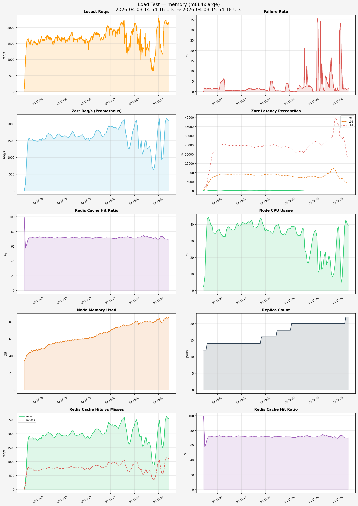

# Load Test Report — memory (m8i.4xlarge)

**Generated:** 2026-04-03 16:07:44
**Test window:** 2026-04-03 14:54:16 UTC → 2026-04-03 15:54:18 UTC

## Time Series Charts

## Performance Over Time (sampled every ~5 min)

| Time | Zarr req/s | p50 (ms) | p95 (ms) | p99 (ms) | Cache Hit % | CPU % | Mem (GB) | Mem % |
|------|-----------|----------|----------|----------|-------------|-------|----------|-------|
| 14:54 | 4.4 | 265.6 | 845.2 | 974.2 | 99.0% | 2.3 | 337.4 | 22.3% |
| 14:57 | 1517.6 | 300.6 | 6612.6 | 15745.4 | 71.4% | 39.8 | 462.0 | 30.5% |
| 15:00 | 1493.8 | 455.6 | 8760.5 | 24112.6 | 72.4% | 36.6 | 482.3 | 31.8% |
| 15:03 | 1587.5 | 362.7 | 9155.8 | 25165.2 | 72.3% | 32.7 | 509.8 | 33.6% |
| 15:06 | 1577.6 | 316.4 | 9145.7 | 24805.7 | 71.2% | 36.5 | 550.3 | 36.3% |
| 15:09 | 1661.3 | 368.1 | 9160.8 | 24807.5 | 72.6% | 39.0 | 565.5 | 37.3% |
| 15:12 | 1578.7 | 391.3 | 9114.2 | 24714.0 | 71.1% | 40.8 | 579.4 | 38.2% |
| 15:15 | 1628.1 | 376.9 | 8567.7 | 23640.3 | 71.6% | 37.8 | 591.3 | 39.0% |
| 15:18 | 1685.1 | 352.8 | 8594.6 | 24061.3 | 72.1% | 43.3 | 601.4 | 39.7% |
| 15:21 | 1501.3 | 382.3 | 9164.2 | 24988.4 | 71.5% | 36.1 | 613.2 | 40.5% |
| 15:24 | 1803.0 | 346.7 | 9147.2 | 24844.4 | 71.4% | 39.4 | 646.3 | 42.6% |
| 15:27 | 1637.4 | 263.5 | 8596.3 | 24055.4 | 71.1% | 33.5 | 674.1 | 44.5% |
| 15:30 | 1916.2 | 211.9 | 8144.1 | 23304.3 | 71.3% | 37.4 | 706.9 | 46.6% |
| 15:33 | 1834.9 | 196.7 | 7451.1 | 21051.4 | 71.6% | 33.4 | 740.0 | 48.8% |
| 15:36 | 1741.0 | 69.0 | 7321.7 | 22011.3 | 72.7% | 24.5 | 761.8 | 50.3% |
| 15:39 | 1783.6 | 44.8 | 8008.4 | 25780.7 | 70.9% | 29.6 | 784.6 | 51.8% |
| 15:42 | 1247.9 | 45.4 | 7291.4 | 25690.4 | 72.3% | 12.6 | 790.0 | 52.1% |
| 15:45 | 1243.5 | 42.3 | 9128.6 | 26997.3 | 73.3% | 15.8 | 803.1 | 53.0% |
| 15:48 | 705.1 | 42.4 | 12227.4 | 33957.1 | 71.3% | 10.3 | 800.0 | 52.8% |
| 15:51 | 936.5 | 43.0 | 6899.0 | 28987.6 | 73.4% | 4.5 | 790.0 | 52.1% |
| 15:54 | 2096.8 | 46.4 | 4780.0 | 18935.9 | 69.8% | 39.4 | 855.9 | 56.5% |

## Locust Results

| Metric | Value |
|--------|-------|
| Total Requests | 5,961,942 |
| Failures | 148,099 (2.48%) |
| Requests/s | 1655.9 |
| p50 Latency | 280 ms |
| p95 Latency | 8300 ms |
| p99 Latency | 17000 ms |
| Max Latency | 300071 ms |
| Avg Latency | 1746 ms |

## Prometheus Metrics (avg over test window)

| Metric | Value |
|--------|-------|
| Zarr Req/s | 1588.13 |
| p50 Zarr Latency | 233 ms |
| p95 Zarr Latency | 8161 ms |
| p99 Zarr Latency | 23960 ms |
| 429 Rate Limits/s | N/A |
| 500 Errors/s | 0.55 |
| Avg Cache Hit Rate | 71.5% |
| Avg Cache Hits/s | 1943.20 |
| Avg Cache Misses/s | 773.90 |
| Pod Restarts | 0 |
| Peak Replicas | 22 |
| Avg Node CPU | 3259.8% |
| Avg Node Memory Used | 650.4 GB / 1.5 TB (42.9%) |
| Avg Network RX | 850.4 MB/s |
| Avg Network TX | 1.1 GB/s |
